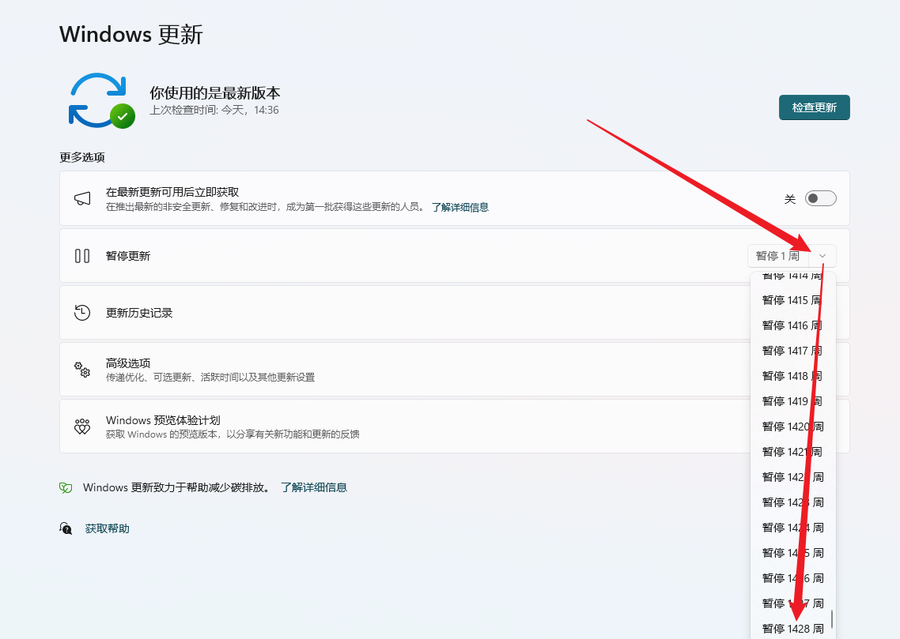
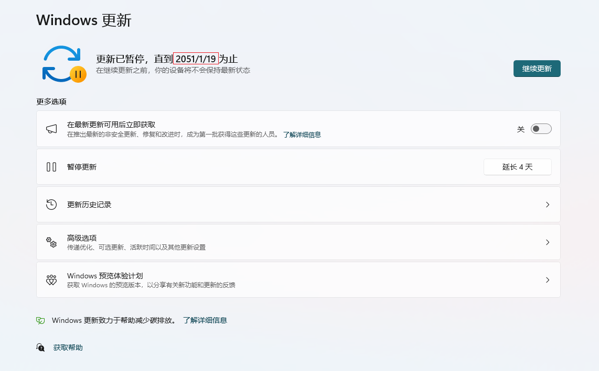

# 免责声明

本软件仅供学习交流使用，禁止修改此软件，修改此软件之后造成的**直接或间接后果**，**均由使用者本人负责**。

此软件使用时可能与其他同类型的软件发生冲突，慎用！！！

MD5: __95e7a74713039ed2e4ce30230b7db704__

SHA1: __741dde673fd2b2a4270b4f76ae6c89f77be18f67__

SHA256: __f8025a983743db235a7c34543a2bf9a71f85b74c108d1e6c7ab53f62bb23d283__

## CloseWindowsAutoUpdate

### 介绍

此软件是一款可以在 Windows 10、Windows 11 中关闭 Windows 自动更新的命令行软件。

---

### 下载

下载链接：[点击下载](https://github.com/f3lze3/CloseWindowsAutoUpdate/releases/download/v0.1/close_windows10-11_update.exe)

---

### 使用

使用时可能存在杀毒软件**误杀**的情况，请在使用此软件之前务必**关闭杀毒软件**。

```python
usage: close_windows10-11_update.exe <Close/Open>
```

#### 1. <u>Windows 10</u>

1. 关闭 Windows 10 的自动更新

```python
close_windows10-11_update.exe Close
```

2. 打开 Windows 10 的自动更新

```python
close_windows10-11_update.exe Open
```

---

#### 2. <u>Windows 11</u>

- 暂停 Windows 11 的更新

```python
close_windows10-11_update.exe Close
```

```python
请选择一种模式（序号）：
1. 暂停Windows 11 更新
2. 停止Windows 11 更新
> 1
```

**运行软件完成之后的手动配置：**





* 开始 Windows 11 的自动更新

**设置 Windows 更新中点击继续更新即可**

---

- 停止 Windows 11 的自动更新

```python
close_windows10-11_update.exe Close
```

```python
请选择一种模式（序号）：
1. 暂停Windows 11 更新
2. 停止Windows 11 更新
> 2
```

- 开启 Windows 11 的自动更新

```python
close_windows10-11_update.exe Open
```